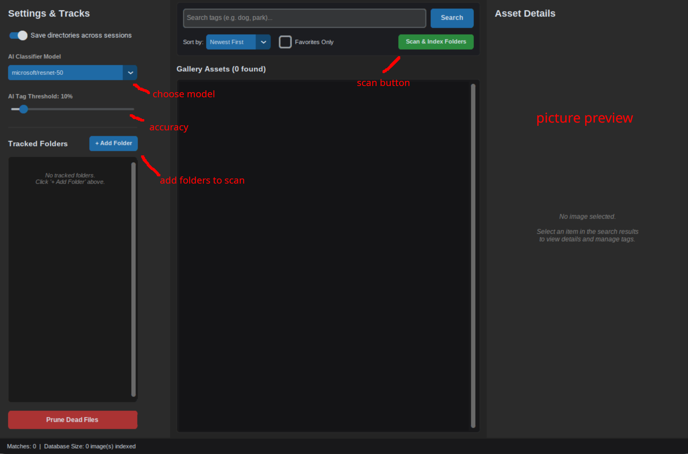
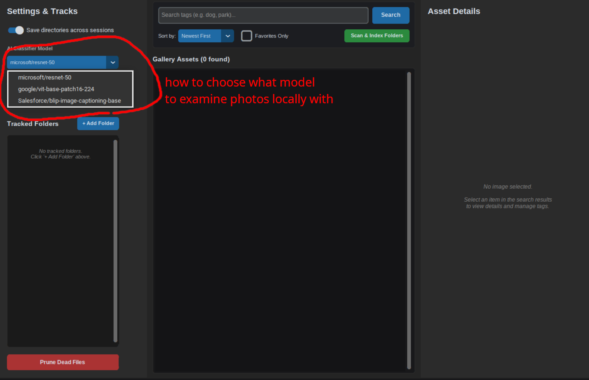

# SiloSight - Local Visual Asset Management Engine

SiloSight is a complete, single-file Windows/cross-platform desktop application that acts as a local visual asset management engine. The app allows users to index local directories, automatically tag images using offline Hugging Face classification and captioning models, manually manage metadata, filter with advanced search parameters, and interact with the results via a polished, modern dark-mode graphical interface.

## Tech Stack
- **GUI Framework**: CustomTkinter (modern dark-mode GUI)
- **Database**: SQLite3 (Standard Library)
- **Image Processing**: PIL (Pillow)
- **AI Framework**: Hugging Face Transformers & PyTorch (CPU or CUDA GPU)
- **Programming Language**: Python 3

---

## Key Features

1. **Directory Management & Privacy Control**:
   - Easily add or remove tracked folders using graphical dialogs.
   - Prominent toggle switch: **"Save directories across sessions (Privacy Mode)"**.
   - When disabled (Privacy Mode enabled), folder paths are kept purely in volatile runtime memory and immediately purged from the SQLite database.

2. **Background Indexer & Database Pruning**:
   - A background thread indexes folders asynchronously, keeping the GUI responsive.
   - Extracts system creation/modification timestamps.
   - Skips corrupted images silently.
   - **"Prune Dead Files"** utility scans the database and purges records of files that have been deleted or moved from disk.

3. **Offline AI Classifier & Captioning**:
   - Choose between multiple offline models via the **AI Settings** panel:
     - `microsoft/resnet-50` (Standard ImageNet image classification)
     - `google/vit-base-patch16-224` (Vision Transformer image classification)
     - `Salesforce/blip-image-captioning-base` (Image-to-text captioning)
   - For classification models, configure an **AI Tag Threshold** slider (1% to 99%) to filter out low-confidence tags.
   - For the BLIP captioning model, SiloSight uses direct loader classes (`BlipProcessor` and `BlipForConditionalGeneration`) to generate natural descriptions, automatically filtering out common English stopwords (e.g., "a", "the", "in", "showing") to produce clean, searchable keyword tags.

4. **Advanced Search & Filter Panel**:
   - Supports multi-word queries (comma or space separated) using SQL `AND` logic across both AI-generated and custom user tags (e.g., "dog, park" requires matches to contain both keywords).
   - Dynamically sort results by "Newest First" or "Oldest First".
   - Toggle "Favorites Only" to show only starred images.

5. **Visual Previews & Native Interaction**:
   - Displays a list of file paths matching the search criteria.
   - Selecting a file displays a dynamically scaled thumbnail preview (up to 200x200 max) in the side editor panel while preserving aspect ratio.
   - Double-clicking any image in the list opens the file in the default native system photo viewer (`os.startfile()` on Windows, falling back to `xdg-open` / `open` on Linux/macOS).

6. **Manual Metadata & Batch Tagging Controls**:
   - **Single Selection**: Displays read-only AI auto-tags, an editable text box for custom user tags, and a star/unstar toggle.
   - **Batch Selection** (Ctrl/Shift-click): Switches the editor panel into bulk actions mode, allowing users to append or overwrite custom user tags, and favorite/unfavorite all selected items simultaneously.

---
## Images ##



---
## Setup & Running

1. **Clone the Repository**:
   ```bash
   git clone https://github.com/cf12craft/SiloSight.git
   cd SiloSight
   ```

2. **Install Dependencies**:
   ```bash
   pip install customtkinter transformers pillow torch
   ```

3. **Run the Application**:
   ```bash
   python app.py
   ```

---

## Compiling Standalone Executable

To compile SiloSight into a single self-contained executable file, use the provided `build.py` script. This packages python, dependencies (like PyTorch, CustomTkinter, and Transformers), and assets together.

Run the build script:
```bash
python build.py
```

After compilation, the standalone executable (`SiloSight.exe` on Windows) will be available in the `dist/` directory.
